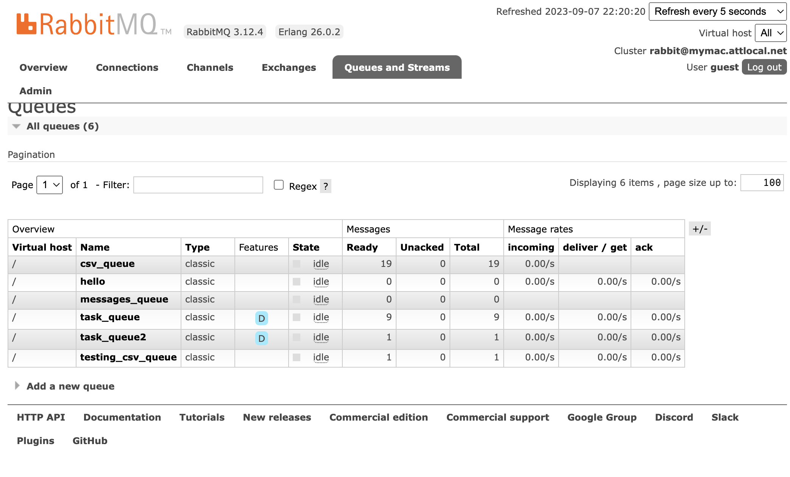

# Project Title: streaming-04-multiple-consumers

Author: Pasquale Salomone
Date: September 6, 2023

This application of RabbitMQ involves distributings tasks to multiple workers.
One process will create task messages. Multiple worker processes will share the work. 

## Prerequisites

1. Git
1. Python 3.7+ (3.11+ preferred)
1. VS Code Editor
1. VS Code Extension: Python (by Microsoft)

The following modules are required: 

| Module          | Version  |
|-----------------|----------|
| csv             | 1.0      |
| logging         | 0.5.1.2  |
| webbrowser      | 3.11.4   |
| sys             | 3.11.4   |
| time            | 3.11.4   |
| pika            | 1.3.2    |

## Notes

I only implemented the logging functionality in lieu of the print statements in the emitter_of_taks file  as I like receiving some sort of feedback on screen:

`ch.basic_publish(exchange="", routing_key=queue_name, body=message)
        # log the message instead of printing it
        dot_count = message.count('.')
        time.sleep(dot_count)
        logging.info(f" [x] Sent {message}")`      

## Multiple Terminals Screenshots

See a running example with at least 3 concurrent process windows here:

RabbitMQ WebInterface screenshot:

## Suggested Readings

1. Read the [RabbitMQ Tutorial - Work Queues](https://www.rabbitmq.com/tutorials/tutorial-two-python.html)
1. Read the code and comments in this repo.

- [RabbitMQ Tutorial - Work Queues](https://www.rabbitmq.com/tutorials/tutorial-two-python.html)

## Acknowledgments

I would like to acknoledge both Stackoverflow and ChatGPT as an instrumental aid in the development of this project.
